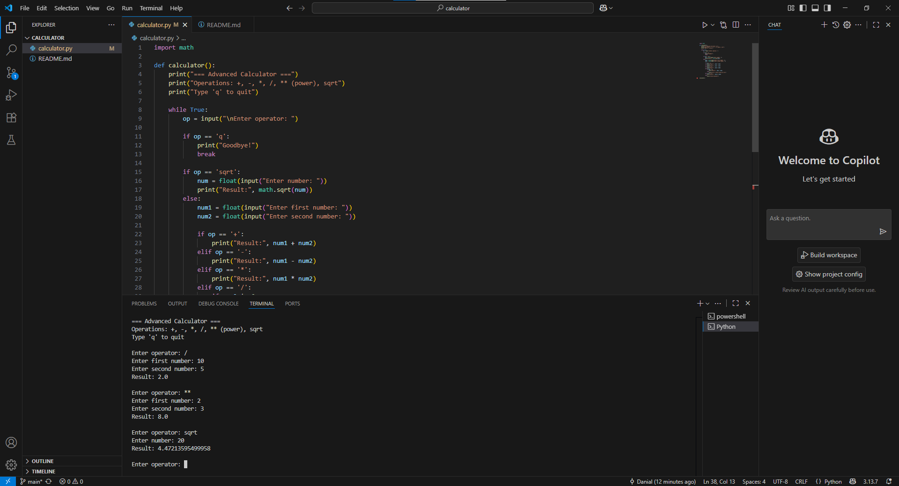

# 🧮 Python Calculator  


A beginner-friendly calculator built in Python.  
Supports **basic and advanced math operations**.  

---

## 🚀 Features
- ➕ Addition, ➖ Subtraction, ✖️ Multiplication, ➗ Division  
- 🔢 Powers (`**`)  
- 📐 Square root (`sqrt`)  
- ❌ Graceful handling of division by zero  
- 🚪 Exit option (`q`)  

---

## 📸 Screenshot
<p align="center">
  
</p>

---

## ▶️ How to Run
1. Install [Python](https://www.python.org/downloads/)  
2. Clone this repo:  
   ```bash
   git clone https://github.com/danialshuib/calculator.git
   cd calculator
